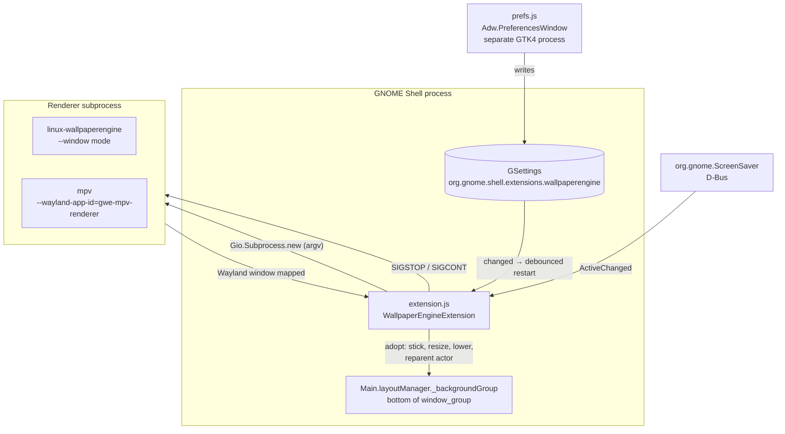
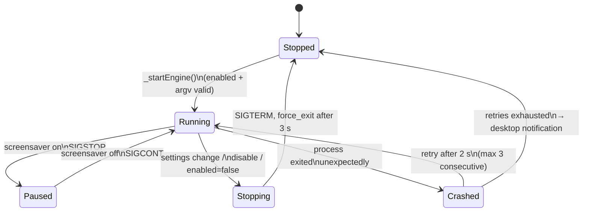

# Architecture

[← Documentation index](index.md)

This page explains how the extension works internally. File references point at
[`extension.js`](../extension.js).

## The problem: wallpapers on GNOME Wayland

On wlroots compositors (Sway, Hyprland), wallpaper tools use the
**`wlr-layer-shell`** Wayland protocol to place a surface in the background
layer. GNOME's compositor, **Mutter, does not implement layer-shell** and has
no public API for external processes to render behind the desktop.

The only place with the authority to restack arbitrary windows on GNOME
Wayland is GNOME Shell itself — which is exactly where an extension runs. So
instead of asking the compositor for a background surface, this extension
**takes a normal window and moves it into the background from inside the
compositor**.

## Component overview



Three processes are involved:

| Process | Code | Role |
|---|---|---|
| GNOME Shell | `extension.js` | Orchestration: spawn, embed, pause, restart, teardown |
| Renderer | `linux-wallpaperengine` or `mpv` | Decodes and draws the wallpaper; knows nothing about the extension |
| Preferences | `prefs.js` | GTK4/Libadwaita dialog; communicates only through GSettings |

The Shell main thread is never blocked: the subprocess is spawned with
`Gio.Subprocess` (stdout/stderr silenced so pipes can't fill), exit is observed
with `wait_async()`, and all timers are GLib main-loop sources.

## Engine selection and command construction

`_resolveEngine()` implements the *Automatic* mode: `wallpaperengine` iff a
scene is configured **and** the binary exists (absolute path → executable
check; bare name → `GLib.find_program_in_path`), else `mpv`.

`_buildWallpaperEngineArgv()` / `_buildMpvArgv()` translate GSettings into
argv (full mapping in [Configuration Reference](configuration.md#setting--engine-flag-mapping)).
Two details matter:

- **wallpaperengine** is launched with `--window 0x0xWIDTHxHEIGHT` — *not*
  `--screen-root` — because layer-shell/X11-root tricks don't exist on GNOME
  Wayland. The window's position is meaningless on Wayland; the extension
  positions it after adoption.
- **mpv** is launched with `--wayland-app-id=gwe-mpv-renderer` (plus matching
  `--title` and `--x11-name`), giving the extension a reliable identity to
  match on, and `--no-config` so user mpv configs can't interfere.

If prerequisites are missing (no file configured, file not found, binary not
launchable), the engine is not started and `Main.notify()` tells the user
what to fix — see `_notifyError()`.

## Window adoption (the core trick)

Sequence, starting in `enable()` where the extension connects to
`global.display::window-created`:

1. **A window appears.** `_onWindowCreated()` ignores it unless an engine
   process is running and no renderer window is adopted yet. Because Wayland
   app-ids and titles often arrive *after* creation, it polls the window every
   100 ms, up to 20 times (`WINDOW_MATCH_INTERVAL_MS`, `WINDOW_MATCH_RETRIES`).
2. **Identity check.** `_windowMatchesRenderer()` matches primarily by **PID**
   — `Meta.Window.get_pid()` against `Gio.Subprocess.get_identifier()` — with a
   fallback list of known wm-classes/titles (`gwe-mpv-renderer`,
   `linux-wallpaperengine`, …). PID matching makes the adoption robust even if
   the engine changes its window naming.
3. **Adoption.** `_tryAdoptWindow()` then:
   - `window.stick()` — visible on all workspaces;
   - `window.lower()` — drop to the bottom of the normal stack;
   - `window.move_resize_frame(false, x, y, w, h)` — exact target-monitor
     geometry from `_targetGeometry()` (primary monitor when
     `monitor-index` is −1 or out of range);
   - **reparents the window's compositor actor**
     (`window.get_compositor_private()`) out of the normal window stack into
     `Main.layoutManager._backgroundGroup`.
4. **Focus restoration.** Mapping stole focus, so the most-recently-used
   normal window from `global.display.get_tab_list()` is re-activated.
5. **Lifecycle tie-in.** A handler on the window's `unmanaged` signal clears
   the references when the window goes away.

### Why reparenting into `_backgroundGroup` gives true wallpaper stacking

GNOME Shell's actor tree (simplified):

```
stage
└── uiGroup
    ├── window_group
    │   ├── _backgroundGroup      ← static wallpapers live here (bottom)
    │   │   └── [renderer actor]  ← we insert the video here
    │   └── [normal window actors, incl. desktop-icon windows]
    ├── overviewGroup, panelBox, …
```

`_backgroundGroup` sits at the very bottom of `window_group`. Placing the
renderer's actor there means it draws **above** the static wallpaper but
**below every window actor** — including the desktop-icons window (DING) —
which is precisely the stacking of a real wallpaper. Since both groups share
the same coordinate space, the actor's monitor-aligned position is preserved,
and Mutter continues to drive the actor's transforms as the window's own.

A side effect worth knowing: because the actor is part of the background,
workspace thumbnails and the overview show the animated wallpaper as
background, which is the desired look.

On release (`_releaseWindow()`, called on stop/disable), the actor is handed
back to `global.window_group` *before* the process is killed, so Mutter
destroys the window actor from the parent it expects.

## Power management

Two independent mechanisms:

| Trigger | Mechanism | Effect |
|---|---|---|
| Screensaver / screen blank | D-Bus subscription to `org.gnome.ScreenSaver` `ActiveChanged` → `_setPaused()` | `SIGSTOP` freezes the engine (0% CPU/GPU, state kept in RAM); `SIGCONT` resumes instantly on wake |
| Lock screen | `metadata.json` declares `"session-modes": ["user"]` | GNOME disables the extension entirely on lock → `disable()` runs → engine terminated. Re-enabled (and engine restarted) on unlock |

`_stopEngine()` always sends `SIGCONT` before terminating so a frozen process
can actually handle `SIGTERM`.

## Process lifecycle and crash recovery



Key constants (top of `extension.js`): `RESTART_DEBOUNCE_MS = 700`,
`CRASH_RETRY_DELAY_MS = 2000`, `MAX_CRASH_RETRIES = 3`,
`STABLE_RUNTIME_US = 30 s` (uptime beyond this resets the retry counter, so a
wallpaper that runs fine for hours gets fresh retries after a rare crash).

Exit detection is `wait_async()`; `_onEngineExited()` distinguishes deliberate
stops (`_procStopping`) from crashes. Termination is graceful-then-forceful:
`SIGTERM`, then `force_exit()` (SIGKILL) after 3 s; `disable()` uses the
immediate path since renderers have no state to save.

## Restart triggers

`_scheduleRestart()` (single debounced 700 ms timer) is invoked by:

- any GSettings change (`changed` on the settings object),
- monitor layout changes (`Main.layoutManager::monitors-changed` — hotplug,
  resolution or arrangement changes).

The restart path is stop → (if `enabled`) start, and also resets the crash
counter, so "toggle a setting" doubles as the user-facing retry mechanism.

## Teardown guarantees

`disable()` must leave GNOME Shell exactly as found (this also runs on every
screen lock). It:

1. sets `_destroyed` so late async callbacks become no-ops,
2. disconnects all signals (`window-created`, `monitors-changed`, settings,
   D-Bus subscription),
3. removes every GLib source (`_clearTimeouts()` — restart, retry, kill, and
   all window-match pollers),
4. `_stopEngine(true)`: releases/reparents the window actor, `SIGCONT` if
   paused, then `force_exit()`,
5. drops the settings reference.

## Security & robustness notes

- The renderer runs as the user with no elevated privileges and inherits the
  session environment (needed for `WAYLAND_DISPLAY`).
- stdout/stderr are silenced (`Gio.SubprocessFlags.*_SILENCE`) — a chatty
  engine can never fill a pipe and stall.
- All user-supplied values are passed as **argv elements**, never through a
  shell — no quoting/injection surface.
- `Main.layoutManager._backgroundGroup` is technically a private member of
  GNOME Shell. It has been stable across 45–48 and the same approach is used
  by other established wallpaper extensions, but it is the one point to
  re-verify when a new GNOME major release lands
  (see [Development](development.md#porting-to-a-new-gnome-version)).
